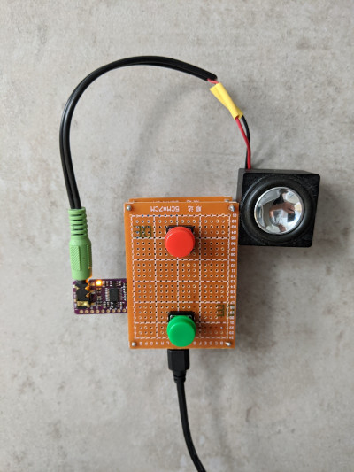

ESP32 White Noise Box 

==============

Simple device which plays any given wav file. Used to play white noise sounds like rain, waterfalls or vacuum cleaner.

TODOs
-----

- [x] Connect ESP32 with DAC
- [x] Play simple wav file with pcm5102a DAC
- [x] Implement buttons
- [x] Build enclosure

